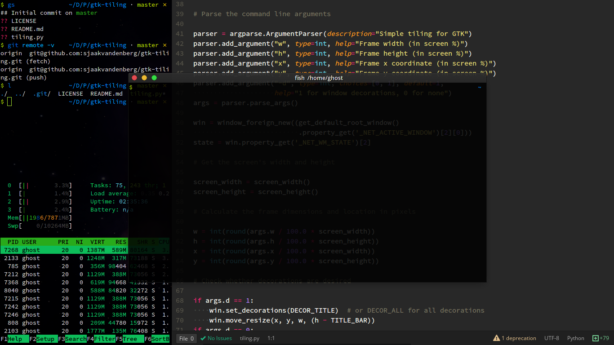
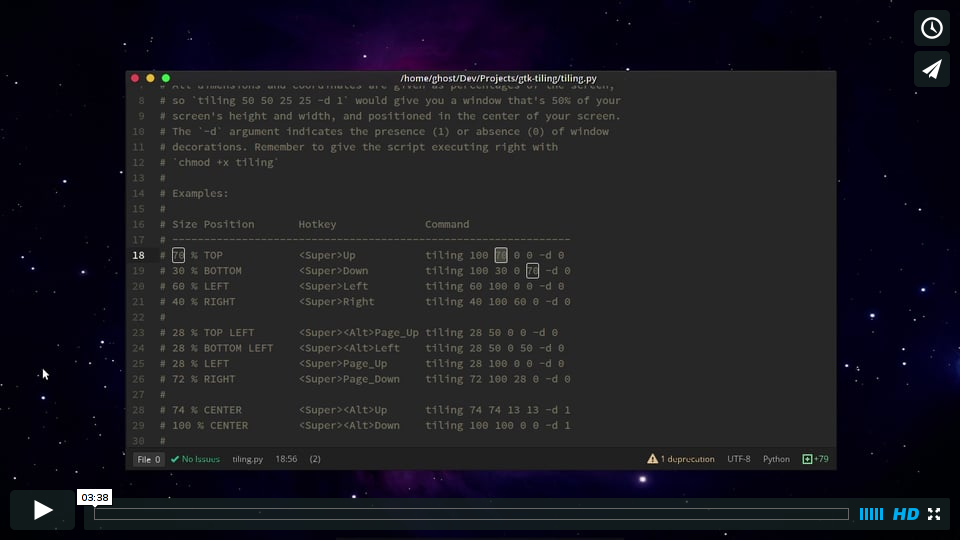

# Simple tiling for GTK

To download, save the repo as a zip or run `git clone https://github.com/sjaakvandenberg/gtk-tiling.git`. You'll also need `python2`, and `pygtk`.

```sh
chmod +x tiling.py        # give the script permissions to be executed
./tiling.py w h x y -d 1  # w (width), h (height) are dimensions in screen %
                          # -d enables (1) or disables (0) window decorations
```

# Example Grid Configuration

| Size Position    | Hotkey            | Command                      |
|------------------|-------------------|------------------------------|
| 70 % TOP         | Super+Up          | `tiling.py 100 70 0 0 -d 0`  |
| 30 % BOTTOM      | Super+Down        | `tiling.py 100 30 0 70 -d 0` |
| 60 % LEFT        | Super+Left        | `tiling.py 60 100 0 0 -d 0`  |
| 40 % RIGHT       | Super+Right       | `tiling.py 40 100 60 0 -d 0` |
| 28 % TOP LEFT    | Super+Alt+Page_Up | `tiling.py 28 50 0 0 -d 0`   |
| 28 % BOTTOM LEFT | Super+Alt+Left    | `tiling.py 28 50 0 50 -d 0`  |
| 28 % LEFT        | Super+Page_Up     | `tiling.py 28 100 0 0 -d 0`  |
| 72 % RIGHT       | Super+Page_Down   | `tiling.py 72 100 28 0 -d 0` |
| 74 % CENTER      | Super+Alt+Up      | `tiling.py 74 74 13 13 -d 1` |
| 100 % CENTER     | Super+Alt+Down    | `tiling.py 100 100 0 0 -d 1` |

# Screenshot



# Video Tutorial

[](https://vimeo.com/133853415)

By Sjaak van den Berg
&mdash; [@svdb](https://twitter.com/svdb)
